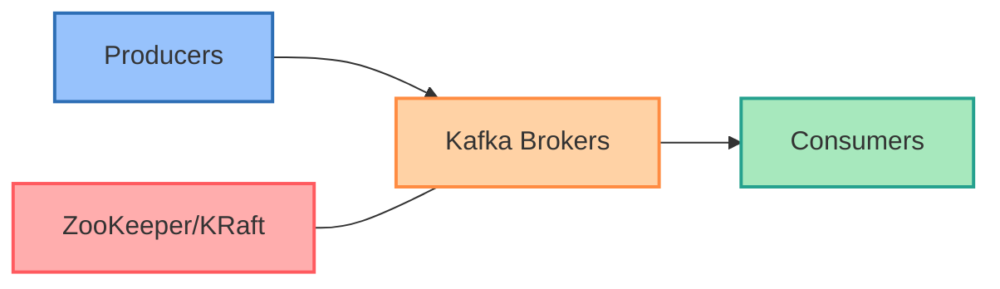
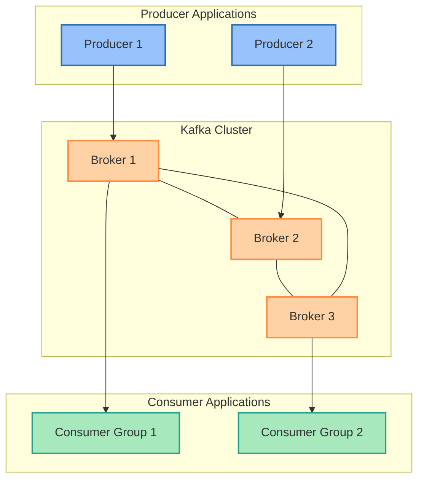
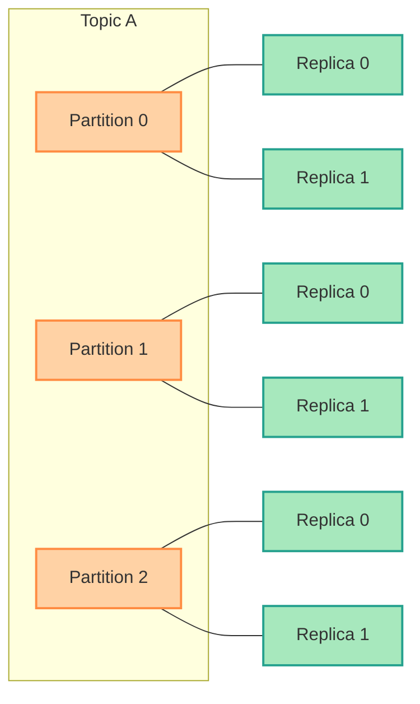
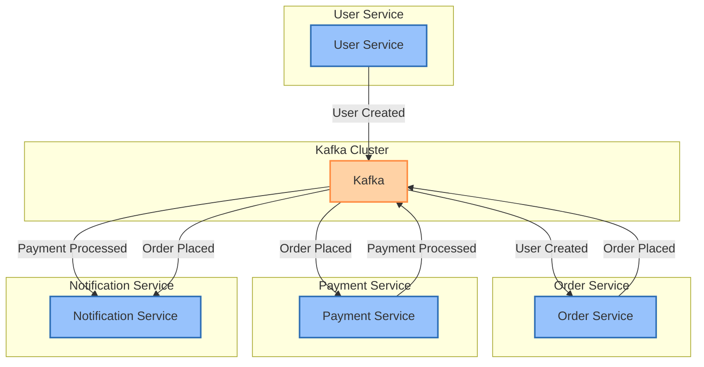
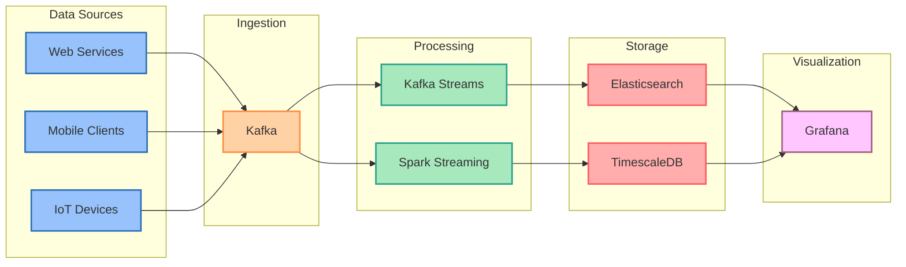
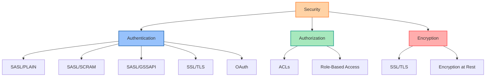
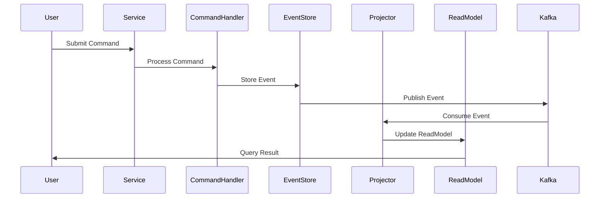
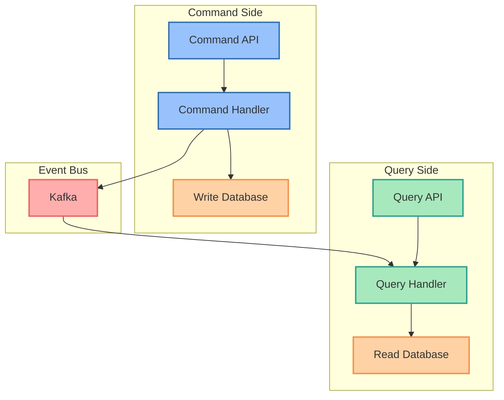
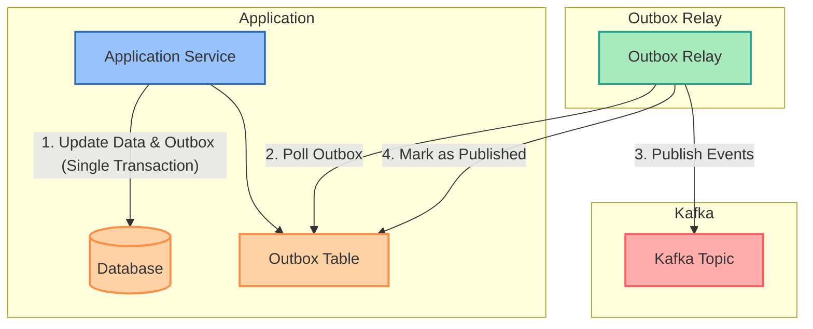
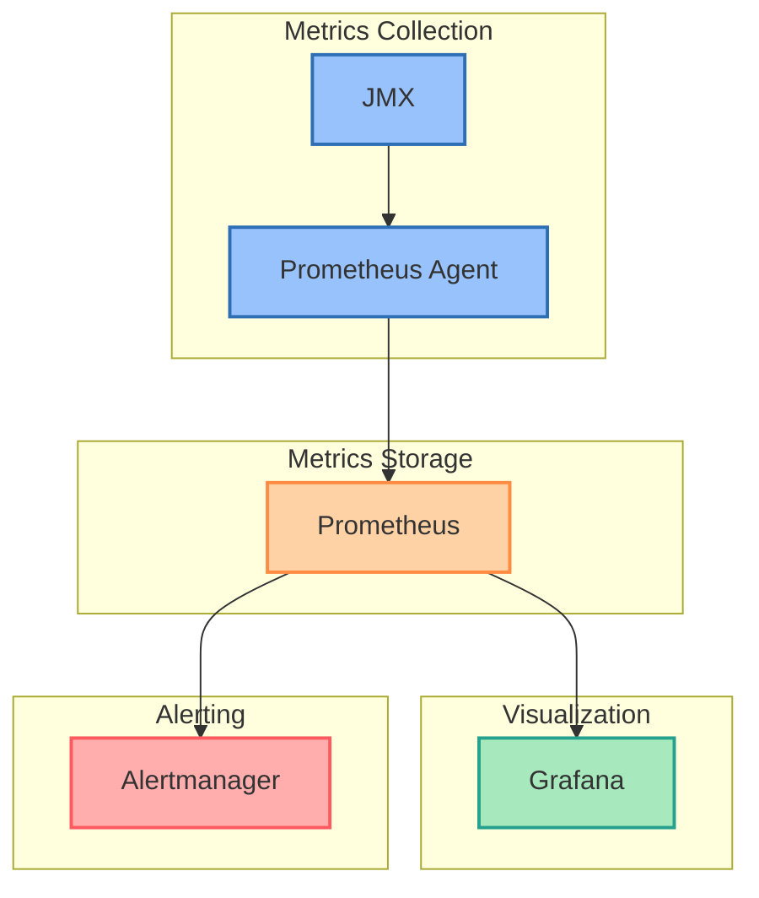

# Kafka Absolute Mastery

<div align="center">
  

[](LICENSE)
[](CONTRIBUTING.md)
[](https://github.com/yourusername/kafka-absolute-mastery)
</div>

## 🚀 Introduction

Welcome to **Kafka Absolute Mastery** - your comprehensive guide to mastering Apache Kafka from fundamentals to advanced implementation patterns. This repository provides practical examples, architectural patterns, and best practices for building robust, scalable, and high-performance event streaming applications.

## 📋 Table of Contents

- [Core Concepts](#core-concepts)
- [Architecture](#architecture)
- [Installation](#installation)
- [Quickstart](#quickstart)
- [Real-World Examples](#real-world-examples)
- [Performance Tuning](#performance-tuning)
- [Security](#security)
- [Advanced Patterns](#advanced-patterns)
- [Monitoring](#monitoring)
- [Troubleshooting](#troubleshooting)
- [Contributing](#contributing)
- [License](#license)

## 🧠 Core Concepts

Apache Kafka is a distributed event streaming platform capable of handling trillions of events a day. Here are the foundational concepts:

### Event Streaming Architecture



### Key Components

- **Topics**: Named feeds of records
- **Partitions**: Units of parallelism within topics
- **Producers**: Applications that publish records to topics
- **Consumers**: Applications that subscribe to topics and process records
- **Consumer Groups**: Groups of consumers that collectively consume all records from a topic
- **Brokers**: Kafka servers that store and serve records
- **ZooKeeper/KRaft**: Coordination service for managing Kafka cluster

## 🏗️ Architecture

### Kafka Cluster Architecture



### Topic and Partition Structure



## 🛠️ Installation

### Docker Compose

Get started quickly with Docker Compose:

```yaml
version: '3'
services:
  zookeeper:
    image: confluentinc/cp-zookeeper:latest
    environment:
      ZOOKEEPER_CLIENT_PORT: 2181
      ZOOKEEPER_TICK_TIME: 2000
    ports:
      - "2181:2181"
  
  kafka:
    image: confluentinc/cp-kafka:latest
    depends_on:
      - zookeeper
    ports:
      - "9092:9092"
    environment:
      KAFKA_BROKER_ID: 1
      KAFKA_ZOOKEEPER_CONNECT: zookeeper:2181
      KAFKA_ADVERTISED_LISTENERS: PLAINTEXT://kafka:29092,PLAINTEXT_HOST://localhost:9092
      KAFKA_LISTENER_SECURITY_PROTOCOL_MAP: PLAINTEXT:PLAINTEXT,PLAINTEXT_HOST:PLAINTEXT
      KAFKA_INTER_BROKER_LISTENER_NAME: PLAINTEXT
      KAFKA_OFFSETS_TOPIC_REPLICATION_FACTOR: 1
```

### Kubernetes

For production deployments, we recommend using Kubernetes with Strimzi:

```yaml
apiVersion: kafka.strimzi.io/v1beta2
kind: Kafka
metadata:
  name: kafka-cluster
spec:
  kafka:
    version: 3.4.0
    replicas: 3
    listeners:
      - name: plain
        port: 9092
        type: internal
        tls: false
      - name: tls
        port: 9093
        type: internal
        tls: true
    config:
      offsets.topic.replication.factor: 3
      transaction.state.log.replication.factor: 3
      transaction.state.log.min.isr: 2
      default.replication.factor: 3
      min.insync.replicas: 2
    storage:
      type: jbod
      volumes:
      - id: 0
        type: persistent-claim
        size: 100Gi
        deleteClaim: false
  zookeeper:
    replicas: 3
    storage:
      type: persistent-claim
      size: 20Gi
      deleteClaim: false
  entityOperator:
    topicOperator: {}
    userOperator: {}
```

## 🚦 Quickstart

### Create a Topic

```bash
# Create a topic with 3 partitions and replication factor of 3
kafka-topics.sh --bootstrap-server localhost:9092 \
                --create \
                --topic sample-topic \
                --partitions 3 \
                --replication-factor 3
```

### Produce Messages

```bash
# Produce messages to the topic
kafka-console-producer.sh --bootstrap-server localhost:9092 \
                         --topic sample-topic
```

### Consume Messages

```bash
# Consume messages from the topic
kafka-console-consumer.sh --bootstrap-server localhost:9092 \
                         --topic sample-topic \
                         --from-beginning
```

## 💻 Real-World Examples

### Event-Driven Microservices



### Stream Processing with Kafka Streams

```java
import org.apache.kafka.streams.StreamsBuilder;
import org.apache.kafka.streams.kstream.KStream;

StreamsBuilder builder = new StreamsBuilder();

// Create a stream from the input topic
KStream<String, String> inputStream = builder.stream("input-topic");

// Process the stream
KStream<String, String> processedStream = inputStream
    .filter((key, value) -> value != null && value.length() > 0)
    .mapValues(value -> value.toUpperCase());

// Write the processed stream to an output topic
processedStream.to("output-topic");
```

### Real-time Analytics Dashboard



## ⚙️ Performance Tuning

### Producer Optimizations

| Configuration | Description | Recommendation |
|---------------|-------------|----------------|
| `batch.size` | Maximum batch size in bytes | 16384 - 131072 |
| `linger.ms` | Time to wait before sending messages | 5-100 ms |
| `compression.type` | Message compression algorithm | `lz4` or `zstd` |
| `acks` | Acknowledgment level | `all` for durability, `1` for performance |

### Consumer Optimizations

| Configuration | Description | Recommendation |
|---------------|-------------|----------------|
| `fetch.min.bytes` | Minimum data to fetch | 1024 - 65536 |
| `fetch.max.wait.ms` | Maximum fetch wait time | 100 - 500 ms |
| `max.poll.records` | Maximum records per poll | 300 - 500 |
| `auto.commit.interval.ms` | Commit interval | 1000 - 5000 ms |

### Broker Optimizations

| Configuration | Description | Recommendation |
|---------------|-------------|----------------|
| `num.network.threads` | Number of network threads | 3 * (CPU cores) |
| `num.io.threads` | Number of I/O threads | 8 * (CPU cores) |
| `socket.send.buffer.bytes` | Socket send buffer | 1048576 (1MB) |
| `socket.receive.buffer.bytes` | Socket receive buffer | 1048576 (1MB) |

## 🔒 Security

### Authentication Methods



### SSL/TLS Configuration

```properties
# Broker configuration
listeners=PLAINTEXT://localhost:9092,SSL://localhost:9093
ssl.keystore.location=/path/to/kafka.server.keystore.jks
ssl.keystore.password=keystore-password
ssl.key.password=key-password
ssl.truststore.location=/path/to/kafka.server.truststore.jks
ssl.truststore.password=truststore-password
ssl.client.auth=required

# Client configuration
security.protocol=SSL
ssl.truststore.location=/path/to/client.truststore.jks
ssl.truststore.password=truststore-password
ssl.keystore.location=/path/to/client.keystore.jks
ssl.keystore.password=keystore-password
ssl.key.password=key-password
```

## 🧩 Advanced Patterns

### Event Sourcing



### CQRS (Command Query Responsibility Segregation)



### Transactional Outbox Pattern



## 📊 Monitoring

### Metrics to Track

- **Producer Metrics**
    - request-rate
    - error-rate
    - request-latency-avg
    - batch-size-avg
    - record-send-rate

- **Consumer Metrics**
    - records-consumed-rate
    - bytes-consumed-rate
    - fetch-rate
    - consumer-lag

- **Broker Metrics**
    - under-replicated-partitions
    - request-handler-avg-idle-percent
    - request-queue-size
    - network-processor-avg-idle-percent

### Visualization Stack



## 🔍 Troubleshooting

### Common Issues and Solutions

| Issue | Possible Causes | Solutions |
|-------|----------------|-----------|
| High Consumer Lag | Slow consumer processing<br>Insufficient resources | Increase consumer instances<br>Optimize consumer code<br>Increase hardware resources |
| Under-replicated Partitions | Network issues<br>Broker failures<br>Disk issues | Check network connectivity<br>Restart failed brokers<br>Verify disk space and I/O |
| Producer Timeouts | Network issues<br>Broker overload<br>Full disk | Check network connectivity<br>Add more brokers<br>Verify disk space |
| Uneven Partition Distribution | Poor partition assignment<br>Uneven data distribution | Use custom partitioner<br>Evaluate key distribution<br>Rebalance partitions |

### Debugging Tools

- **Kafka Command Line Tools**:
    - `kafka-topics.sh`: Manage topics
    - `kafka-consumer-groups.sh`: Monitor consumer groups
    - `kafka-dump-log.sh`: Examine log segments
    - `kafka-configs.sh`: View and modify configurations

- **Third-party Tools**:
    - [Conduktor](https://www.conduktor.io/): Kafka GUI for monitoring and management
    - [Kafdrop](https://github.com/obsidiandynamics/kafdrop): Web UI for Kafka
    - [Kafka Exporter](https://github.com/danielqsj/kafka_exporter): Prometheus exporter

## 🤝 Contributing

Contributions are welcome! Please feel free to submit a Pull Request.

1. Fork the repository
2. Create your feature branch (`git checkout -b feature/amazing-feature`)
3. Commit your changes (`git commit -m 'Add some amazing feature'`)
4. Push to the branch (`git push origin feature/amazing-feature`)
5. Open a Pull Request

## 📄 License

This project is licensed under the Apache License 2.0 - see the [LICENSE](LICENSE) file for details.

---

<div align="center">
  <p>Made with ❤️ by <a href="https://github.com/yourusername">Your Name</a></p>
  <p>⭐ Star this repository if it helped you!</p>
</div>